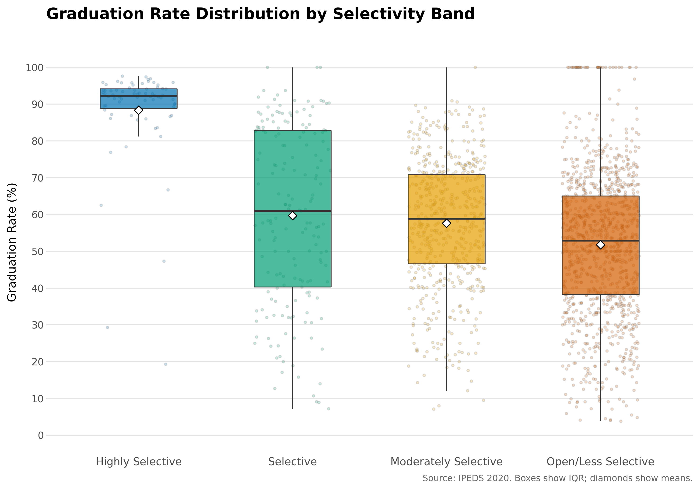
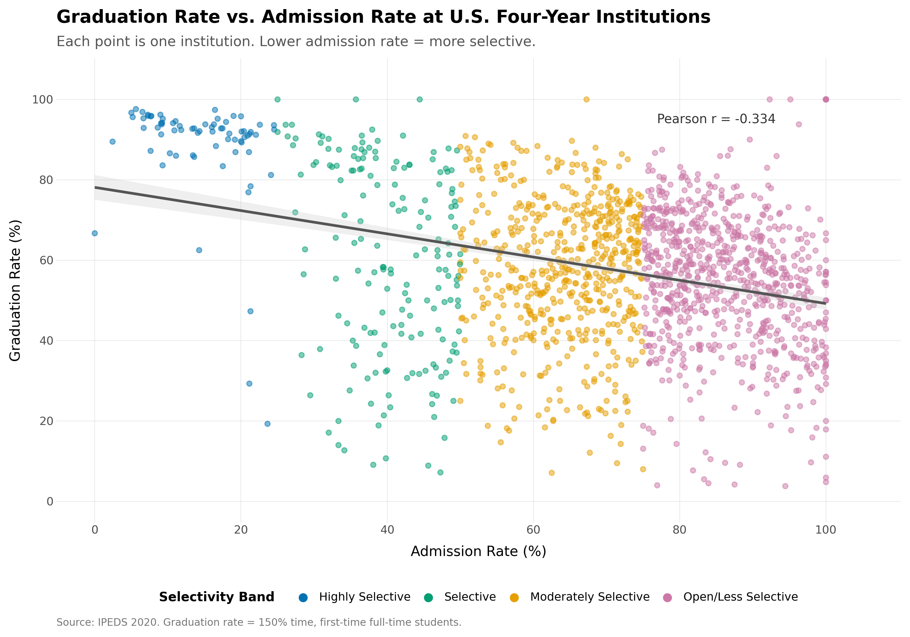
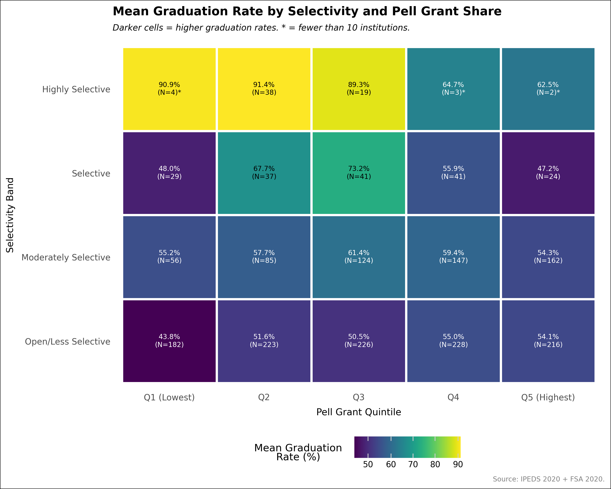
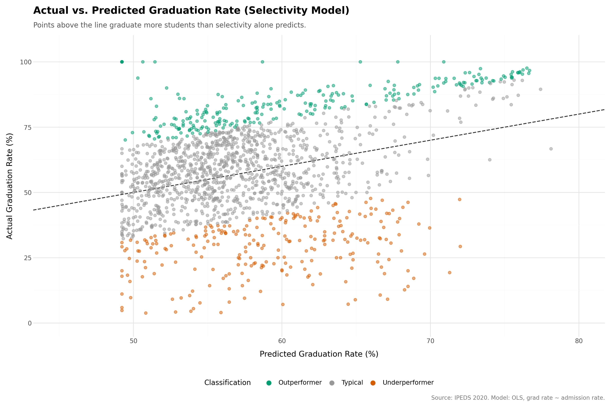
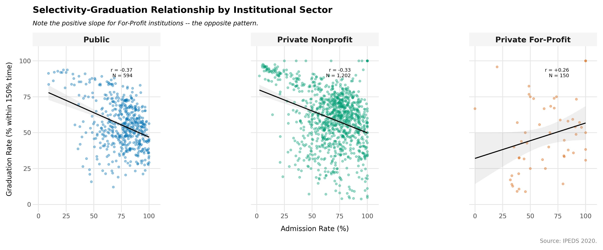
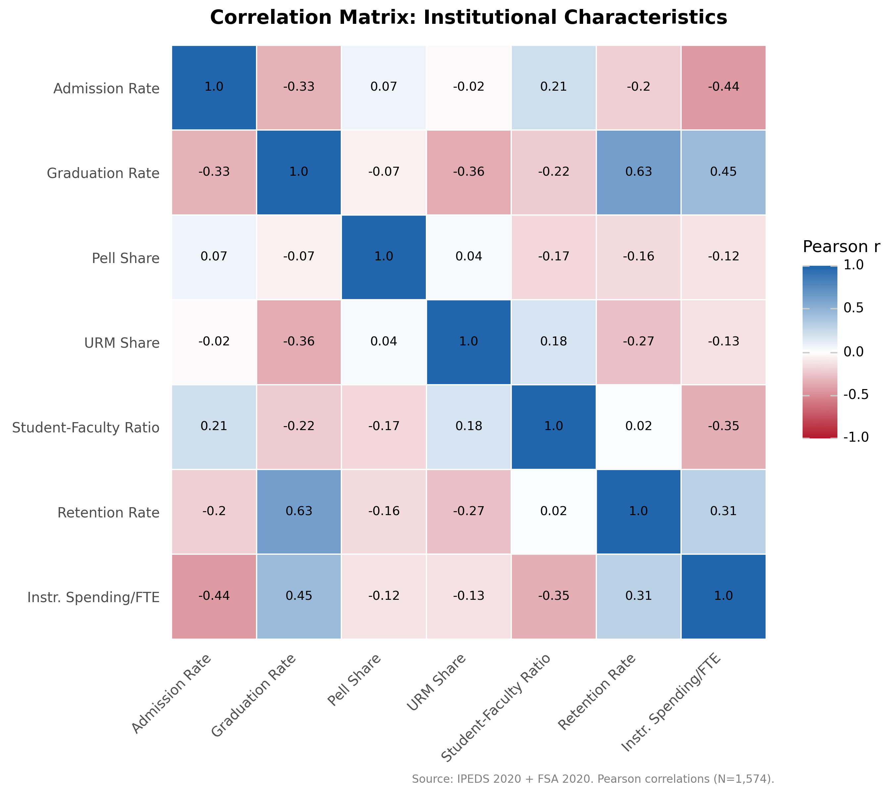

# College Graduation Rate & Selectivity Analysis

**Date:** 2026-03-29
**Version:** Original

---

## MAINTAINER'S NOTE
This analysis was conducted as a demonstration of the project Full Pipeline mode workflow. It is presented in its entirety without editing; the author did a couple of quick visualization fixes after the fact via Revision and Extension mode, but all products and outputs are exactly as Claude produced them. The goal here is not to demonstrate a perfect project, but to demonstrate a realistic output that can and should be thoroughly reviewed by the user.

## Executive Summary

This analysis of 1,946 four-year degree-granting institutions finds that while more selective colleges do graduate students at higher rates, selectivity itself explains only about 11% of the variation in graduation rates -- far less than commonly assumed. Institutional resources like spending per student and first-year retention rates collectively explain over 55% of the variation, dwarfing the role of admissions selectivity alone. In fact, after accounting for institutional resources, the relationship between admission rate and graduation rate weakens by more than half -- and this attenuation is driven entirely by resources (spending, retention support, staffing), not by differences in student demographics. Roughly 1 in 6 institutions (248 schools) graduate students at rates well above what their selectivity would predict, suggesting that institutional practices -- not just the students they admit -- matter enormously. These findings challenge the common use of graduation rates as a simple barometer of college "quality" and point instead toward a more nuanced picture where what a school does with its students matters at least as much as which students it selects.

---

## Research Question

> How much of the variation in college graduation rates is attributable to institutional selectivity (admission rates) versus institutional effectiveness, and how do factors like financial aid dependency (Pell Grant share), underserved student populations (URM enrollment), institutional resources (spending, student-faculty ratio), and sector (public vs. private) complicate this relationship? What are the implications for interpreting graduation rates as a measure of college "quality"?

**Context:** Graduation rates are widely used by rankings, policymakers, and the public as a proxy for institutional quality. However, a substantial body of higher education research demonstrates that graduation rates are heavily confounded with selectivity -- institutions that admit already-prepared students naturally graduate more of them. This creates a "chicken-or-the-egg" problem: high graduation rates may reflect effective teaching and support, or simply selective admissions. This analysis uses publicly available federal data to make this relationship transparent and accessible.

---

## Data & Methods

### Data Sources

| Source | Description | Years | Records |
|--------|-------------|-------|---------|
| IPEDS Directory | Institution name, state, sector, control, degree-granting status | 2020 | 2,893 (4-yr degree-granting) |
| IPEDS Admissions-Enrollment | Applicants, admitted, enrolled (for computing admission rate) | 2020 | 1,989 reporting institutions |
| IPEDS Graduation Rates | 150% normal time completion rate, bachelor's-seeking cohort | 2020 | 2,010 institutions |
| IPEDS SFA Grants & Net Price | Federal grant recipients (proxy for Pell Grant share) | 2020 | 5,320 institution-level records |
| IPEDS Fall Enrollment by Race | Enrollment by race/ethnicity (for computing URM share) | 2020 | 5,837 institutions |
| IPEDS Student-Faculty Ratio | Student-to-faculty ratio | 2020 | 5,835 institutions |
| IPEDS Fall Retention | First-year, full-time retention rate | 2020 | 5,836 institutions |
| IPEDS Finance | Instructional expenditure and estimated FTE enrollment | 2017 | 6,522 institutions |

### Key Variables

| Variable | Description | Source |
|----------|-------------|--------|
| `completion_rate_150pct` | Graduation rate within 150% of normal time (6 years for bachelor's) | IPEDS Graduation Rates |
| `admit_rate` | Admission rate (admitted / applied, as percentage) | Computed from IPEDS Admissions |
| `pell_share` | Share of undergraduates receiving federal grant aid (proxy for Pell Grant share) | IPEDS SFA / IPEDS Fall Enrollment |
| `urm_share` | Share of undergraduates who are from underrepresented minority groups (Black, Hispanic, American Indian/Alaska Native, Native Hawaiian/Pacific Islander) | Computed from IPEDS Fall Enrollment by Race |
| `student_faculty_ratio` | Number of students per faculty member | IPEDS Student-Faculty Ratio |
| `retention_rate` | First-year, full-time retention rate (percentage) | IPEDS Fall Retention |
| `instr_expend_per_fte` | Instructional expenditure per full-time equivalent student | Computed from IPEDS Finance |
| `selectivity_band` | Highly Selective (<25%), Selective (25-50%), Moderately Selective (50-75%), Open/Less Selective (>=75% or not reporting admissions) | Derived from `admit_rate` |

### Methodology

This analysis takes a primarily descriptive approach, organizing institutions into four selectivity bands and examining how graduation rates and institutional characteristics vary across those bands. The core analytical framework is:

1. **Descriptive profiles** of each selectivity band (means, medians, standard deviations, sample sizes for all key variables)
2. **Cross-tabulations** of selectivity bands with Pell Grant share quintiles and URM enrollment share quintiles
3. **Correlation analysis** across all continuous variables
4. **Outperformer identification** -- institutions whose graduation rates substantially exceed what their selectivity alone would predict (based on OLS residuals exceeding 1 standard deviation)
5. **Sector comparison** -- how the selectivity-graduation relationship differs across public, private nonprofit, and private for-profit institutions
6. **Supplementary hierarchical OLS regression** decomposing graduation rate variance into selectivity, student composition, and institutional resource components

**Key decisions:**
- Descriptive analyses by selectivity bands are the primary analytical approach (per researcher preference for intuitive, easily communicated findings)
- Regression is supplementary -- used to estimate how much selectivity's apparent effect weakens after accounting for other factors
- LEFT joins were used throughout to maximize sample size; institutions with missing data for individual variables are included where possible
- Robust (HC1) standard errors were used for all regression models
- Institutions not reporting admissions data were classified as "Open/Less Selective" (standard IPEDS practice for open-admission institutions)

### Data Cleaning

- **Records analyzed:** 1,946 institutions in the final analysis dataset
- **Starting population:** 2,893 four-year degree-granting institutions (IPEDS Directory, 2020)
- **Records excluded:** 947 institutions lacked both a valid graduation rate and a valid admission rate after cleaning (primarily open-admission institutions without admissions data or very small institutions with suppressed graduation rates)
- **Suppression rate:** Less than 1% across all datasets (IPEDS institutional-level data has minimal suppression)
- **Coded value handling:** All IPEDS coded missing values (-1, -2, -3) were replaced with null before any calculations

---

## Quality Assurance

All analysis code underwent secondary QA review during execution:

| Checkpoint | Stage | What Was Validated | Status |
|------------|-------|-------------------|--------|
| QA1 | Data Fetch (Stage 5) | Schema correctness, year coverage, ID uniqueness, row count ranges | PASSED (9 scripts, 8 WARNINGs) |
| QA2 | Data Cleaning (Stage 6) | Coded value removal, range validation, suppression rate checks | PASSED (8 scripts, 5 WARNINGs) |
| QA3 | Transformation (Stage 7) | Join cardinality, row preservation, derived column logic, band distribution | PASSED (4 scripts, 9 WARNINGs) |
| QA4a | Statistical Analysis (Stage 8.1) | Statistical validity, assumption checks, sample sizes, sparse cell flagging | PASSED (7 scripts, 7 WARNINGs) |
| QA4b | Visualization (Stage 8.2) | Figure accuracy, data source alignment, annotation correctness | PASSED (6 scripts, 4 WARNINGs) |

**QA Notes:**
- Zero BLOCKERs were identified across all 34 scripts reviewed. All 36 WARNINGs were documented and accepted with rationale.
- The FSA Pell Grant endpoint was found to have 100% null recipient data for 2020-2021. This was resolved by using the IPEDS Student Financial Aid (SFA) endpoint, which provides all-grant recipients as a proxy. Since Pell Grants represent approximately 90% of federal grant aid, this proxy slightly overestimates true Pell share.
- The `open_public` variable was discovered to mean "open to the general public" (i.e., an operating institution), not "open admissions." The selectivity band assignment was corrected to classify institutions missing from the admissions dataset as open/less selective instead.
- Finance data outliers (instructional expenditure up to $14.1 million per FTE at specialized professional schools) were addressed with log-transformation in regression models.
- 19 script revisions were required across the pipeline, primarily for plotnine API compatibility fixes and data format mismatches.

**QA Scripts:** `scripts/cr/` contains all QA inspection scripts for reproducibility.

---

## Key Findings

### Finding 1: The Graduation Rate Gap Across Selectivity Bands

Institutions were classified into four selectivity bands, revealing a striking 36.5 percentage point gap in average graduation rates between the most and least selective institutions.

| Selectivity Band | N | Mean Graduation Rate | Median Graduation Rate |
|-----------------|---|---------------------|----------------------|
| Highly Selective (<25% admitted) | 71 | 88.3% | 92.3% |
| Selective (25-50% admitted) | 177 | 59.7% | 61.0% |
| Moderately Selective (50-75% admitted) | 577 | 57.6% | 58.9% |
| Open/Less Selective (>75% or open admissions) | 1,121 | 51.8% | 52.9% |

*Figure 1: Graduation rates by selectivity band. Each box shows the middle 50% of institutions; the line inside is the median. The gap between highly selective and open/less selective institutions is large, but there is substantial overlap -- many open-admission schools outperform many selective ones.*

**Interpretation:** The large gap confirms that selectivity and graduation rates are related -- but the wide spread within each band (particularly the Open/Less Selective category) shows this is far from the whole story. Many less selective institutions achieve graduation rates that rival selective ones.

---

### Finding 2: Selectivity Alone Is a Weak Predictor (H1 Assessment)

**Hypothesis H1** predicted that admission rate and graduation rate would be "strongly" negatively correlated (|r| > 0.5). The data tell a more nuanced story.

The correlation between admission rate and graduation rate is r = -0.334 (95% CI: -0.378 to -0.290), based on 1,574 institutions with complete data. This confirms the expected direction -- lower admission rates go with higher graduation rates -- but the strength is moderate, not strong. Selectivity alone explains only about 11% of the variation in graduation rates (R-squared = 0.112).

*Figure 2: Each dot represents one institution. There is a visible downward trend (more selective institutions tend to graduate more students), but the cloud of points is wide, indicating many factors beyond selectivity are at work.*

**Interpretation:** **H1 is partially supported.** The direction is confirmed (more selective institutions do have higher graduation rates), but the relationship is weaker than predicted -- selectivity is a real but modest factor, not the dominant one.

---

### Finding 3: Most of the "Selectivity Effect" Disappears When You Account for Other Factors (H2 Assessment)

**Hypothesis H2** predicted that after controlling for student demographics and institutional resources, the apparent effect of selectivity would substantially shrink. The hierarchical regression confirms this.

| Model | What It Includes | R-squared | Admit Rate Coefficient |
|-------|-----------------|-----------|----------------------|
| Model 1 | Selectivity only | 0.112 | -0.305 |
| Model 2 | + Student composition (grant share, URM share) | 0.251 | -0.310 |
| Model 3 | + Resources (student-faculty ratio, retention rate, spending) | 0.556 | -0.135 |

The admission rate coefficient shrank by 55.7% from Model 1 to Model 3. However, the pattern of attenuation is revealing: adding student composition variables (Model 1 to Model 2) produced virtually no change in the selectivity coefficient (-0.305 to -0.310), meaning that the demographic characteristics of enrolled students do not independently explain away selectivity's association with graduation rates. The entire attenuation occurs when institutional resources are added (Model 2 to Model 3: -0.310 to -0.135), a 56% reduction. This suggests that what matters is not *who* an institution enrolls but *what resources* it provides -- spending, retention support, and staffing.

Retention rate emerged as the strongest single predictor of graduation rates (r = 0.63 with graduation rate), far exceeding the predictive power of selectivity.

**Interpretation:** **H2 is supported**, but the mechanism is more specific than anticipated. Student demographics (Pell share, URM share) do not independently reduce the selectivity coefficient -- only institutional resources do. This is a stronger finding than simple mediation: it suggests that selectivity's apparent effect operates primarily through the resource advantages that selective institutions enjoy, not through differences in student preparation.

---

### Finding 4: Financial Aid Dependency and Graduation Rates -- A Surprising Pattern (H3 Assessment)

**Hypothesis H3** predicted that among open-admission institutions, those with fewer students on financial aid would outperform those with more. The data show the opposite.

*Figure 3: Average graduation rates by selectivity band and Pell Grant share quintile. Darker cells indicate higher graduation rates. Among open/less selective institutions, those with higher Pell shares actually have higher graduation rates.*

Among Open/Less Selective institutions, those in the highest Pell quintile (most students receiving grant aid) had graduation rates 10.3 percentage points higher than those in the lowest Pell quintile -- the opposite of what was predicted. At middle selectivity levels (Selective and Moderately Selective), the Pell gap was minimal (less than 1 percentage point).

**Interpretation:** **H3 is not supported.** This counterintuitive finding likely reflects a compositional effect: among open-admission institutions, those with high Pell shares may disproportionately include private nonprofit institutions with support structures for low-income students, while those with low Pell shares may include for-profit institutions with lower completion rates overall. The relationship between financial need and graduation outcomes is not as simple as "more financial need equals worse outcomes."

*Note: Three cells in the Highly Selective row have very small sample sizes (N = 2-4) and should not be interpreted as reliable estimates.*

---

### Finding 5: URM Enrollment Concentration and Graduation Rates

Cross-tabulation of selectivity bands with URM enrollment quintiles reveals that the graduation rate gap associated with higher URM shares is largest at the Selective band (28.6 percentage points between the lowest and highest URM quintiles) and smallest at the Open/Less Selective band (10.4 percentage points). At the Highly Selective level, the URM cross-tabulation has an empty cell (Highly Selective x Q5 has zero institutions) and two sparse cells (N=7 and N=4), making estimates unreliable for this band.

**Interpretation:** The URM-graduation gap is not uniform across selectivity levels. It is widest at mid-selectivity institutions, where the mix of institutional resources, student support structures, and demographic composition creates the largest disparities. The relatively smaller gap at open-admission institutions may reflect floor effects (graduation rates are already lower overall) or different institutional cultures. These patterns likely reflect systemic resource inequities rather than student characteristics.

---

### Finding 6: 248 Institutions Are "Beating the Odds"

Approximately 1 in 6 institutions (248 out of 1,625, or 15.3%) graduate students at rates well above what their selectivity alone would predict -- these are "outperformers" whose graduation rates exceed the selectivity-predicted rate by more than one standard deviation.

*Figure 4: Each dot is an institution. The diagonal line shows where actual equals predicted graduation rate based on selectivity alone. Institutions above the line graduate more students than their selectivity would predict; those highlighted as outperformers are substantially above it.*

Outperformers share several characteristics:
- Higher first-year retention rates than typical institutions
- Higher instructional spending per student
- Disproportionately private nonprofit institutions
- Lower URM enrollment shares on average (suggesting the relationship between demographics and outperformance warrants further investigation)

Among underperforming institutions, 14.7% were HBCUs -- a pattern that likely reflects historical underfunding rather than institutional ineffectiveness.

**Interpretation:** The existence of hundreds of outperformers demonstrates that institutional practices and resources can overcome the disadvantage of lower selectivity. These institutions offer tangible models for improving graduation outcomes.

---

### Finding 7: The Selectivity-Graduation Relationship Varies by Sector

The relationship between selectivity and graduation rates is not uniform across institutional sectors.

*Figure 5: The selectivity-graduation relationship shown separately for public, private nonprofit, and private for-profit institutions. Note the reversed direction for for-profit institutions.*

| Sector | N | Mean Graduation Rate | Correlation (selectivity-graduation) |
|--------|---|---------------------|--------------------------------------|
| Public | 594 | 52.8% | r = -0.37 |
| Private Nonprofit | 1,202 | 58.2% | r = -0.33 |
| Private For-Profit | 150 | 45.6% | r = +0.26 (reversed) |

The for-profit sector shows a sign reversal: among for-profit institutions, more selective ones actually have *lower* graduation rates. However, this finding is based on only 52 for-profit institutions with valid admission rate data (35% of the for-profit sample), so it should be interpreted cautiously.

**Interpretation:** Sector context matters greatly. For-profit institutions operate under different incentive structures and serve different student populations, which may explain why the selectivity-graduation pattern that holds for public and nonprofit institutions breaks down entirely in this sector.

---

### Finding 8: What Really Predicts Graduation Rates

The correlation analysis reveals which institutional characteristics are most closely associated with graduation rates:

*Figure 6: Correlation matrix of all key variables. Stronger relationships are shown in darker colors. Retention rate has the strongest relationship with graduation rate.*

The strongest correlates of graduation rate are:
1. **First-year retention rate** (r = 0.63) -- by far the strongest predictor
2. **Admission rate** (r = -0.33) -- moderate, as discussed above
3. **URM share** (r = -0.36) -- higher URM shares are associated with lower graduation rates, likely reflecting systemic inequities rather than student characteristics
4. **Student-faculty ratio** (r = -0.22) -- lower ratios are associated with higher graduation rates

**Interpretation:** If the goal is to improve graduation rates, the evidence points more strongly toward investing in first-year retention programs and institutional resources than toward increasing selectivity. Retention captures something about institutional effectiveness -- how well a school supports students through their critical first year -- that selectivity does not.

---

## Summary Statistics

| Metric | Value |
|--------|-------|
| Total institutions in analysis | 1,946 |
| Institutions with valid admission rate | 1,625 (83.5%) |
| Institutions with complete data for regression | 1,574 (80.9%) |
| Mean graduation rate (all institutions) | Ranges from 88.3% (Highly Selective) to 51.8% (Open/Less Selective) |
| Mean admission rate (reporting institutions) | 71.2% |
| Outperformer institutions identified | 248 (15.3% of institutions with valid admission rate) |
| Variance explained by selectivity alone | 11.2% (R-squared = 0.112) |
| Variance explained by full model | 55.6% (R-squared = 0.556) |
| Selectivity coefficient attenuation | 55.7% (Model 1 to Model 3); entirely from resources, not demographics |
| Data year | 2020 (finance: 2017) |

---

## Limitations

This analysis has the following limitations that should be considered when interpreting results:

1. **First-time, full-time (FTFT) graduation rates only:** IPEDS graduation rates track only first-time, full-time students who entered as freshmen. This excludes transfer students (approximately 40% of all college students) and part-time students (approximately 40%). Open-admission and community college-serving institutions are disproportionately affected because they serve more transfer and part-time students. This means the analysis may understate the true completion performance of less selective institutions.

2. **Cross-sectional design (no causal claims):** This analysis examines relationships at a single point in time and cannot establish whether selectivity *causes* higher graduation rates or whether both are driven by other factors (e.g., institutional wealth, prestige, state funding models). The regression models control for observed characteristics but cannot account for unobserved confounders.

3. **Financial aid proxy, not Pell-specific:** The FSA Pell Grant data was unavailable for 2020 in the data source used. The analysis substitutes IPEDS SFA all-grant recipients as a proxy. Since Pell Grants represent approximately 90% of federal grant aid, this slightly overestimates Pell share and may attenuate differences between institutions with high and low financial need populations. Observed pell_share values were lower than national benchmarks (~0.12 vs. expected ~0.30-0.35), suggesting the proxy may capture first-time recipients rather than total Pell enrollment.

4. **Finance data lag (3-year gap):** Instructional expenditure data is from 2017, while other variables are from 2020. While institutional spending patterns change slowly, this introduces a temporal mismatch. The 2017 data also precedes any COVID-19 fiscal impacts.

5. **Small Highly Selective band (N=71):** Only 71 institutions fall in the Highly Selective category (admission rate below 25%), reflecting the genuine structure of U.S. higher education. Cross-tabulation cells involving this band have very small sample sizes (as low as N=2), making point estimates unreliable. Findings for this band should be interpreted as illustrative rather than statistically precise.

6. **Finance outliers at specialized institutions:** Professional schools (law, medical, optometry) produce instructional expenditure per FTE values up to $14.1 million, which dramatically affect mean calculations. Log-transformation was applied in regression models, but descriptive statistics for spending should be interpreted with awareness of this skew.

7. **COVID-19 data context:** The primary data year is 2020. Graduation rates for 2020 reflect cohorts that entered around 2014 and are thus largely unaffected by pandemic disruptions. However, admissions data for 2020 may reflect early test-optional policies and enrollment shifts. Retention rates may capture the beginning of COVID impacts on first-year students.

8. **Retention rate as a partially tautological predictor:** First-year retention (whether students return for year 2) shares causal structure with graduation (whether students complete). Students who do not return cannot graduate, so retention is mechanically upstream of graduation. This means retention's strong correlation (r = 0.63) and large regression coefficient partly reflect definitional overlap rather than a purely independent institutional effectiveness signal. Retention remains a useful indicator of institutional support, but its predictive power should not be interpreted as fully independent of the outcome it predicts.

9. **URM gap and structural inequities:** The observed negative correlation between URM share and graduation rates reflects systemic factors -- historical underfunding, resource disparities, and socioeconomic inequities -- not student capability. The finding that 14.7% of underperforming institutions are HBCUs should be understood in the context of decades of relative underfunding compared to predominantly White institutions.

---

## References

### Data Sources

> National Center for Education Statistics. (2022). Integrated Postsecondary Education Data System (IPEDS). U.S. Department of Education. Retrieved from Education Data Portal (Urban Institute), https://educationdata.urban.org.

> U.S. Department of Education, Federal Student Aid. (2022). Title IV Program Volume Reports: Pell Grant Data. Retrieved from Education Data Portal (Urban Institute), https://educationdata.urban.org.

> Urban Institute. (2022). Education Data Portal. https://educationdata.urban.org. Accessed via Hugging Face mirror: https://huggingface.co/datasets/brhkim/education_data_portal_mirror.

### Software & Tools

> Kim, B.H. (2026). *DAAF: Data Analyst Augmentation Framework* (Version 2.0.0) [Computer software]. https://github.com/DAAF-Contribution-Community/daaf
> *Cited because: Analysis framework used to orchestrate all stages of this analysis*

> marimo team. marimo: Reactive Python notebook [Computer software]. https://marimo.io/
> *Cited because: Analysis notebook format used for the interactive analytic notebook*

### Reporting Standards

> Feuerriegel, S., Barrie, C., Crockett, M. J., Globig, L. K., McLoughlin, K. L., Mirea, D.-M., Spirling, A., Yang, D., ..., Rathje, S., & Ribeiro, M. H. (2026). "Generative AI Models in Science: Risks and Opportunities -- The GUIDE-LLM Checklist." Available at: https://llm-checklist.com/
> *Cited because: AI disclosure framework used for the AI Use Disclosure section of this report*

---

## AI Use Disclosure

> This analysis was conducted using the **Data Analyst Augmentation Framework (DAAF)** (Kim, 2026), an open-source AI-assisted research orchestration system built on Claude Code (Anthropic). The following disclosure follows the GUIDE-LLM reporting checklist (Feuerriegel et al., 2026). For complete guidance, see `agent_reference/AI_DISCLOSURE_REFERENCE.md`.

**Date of analysis:** 2026-03-29 to 2026-03-30
**DAAF version:** f9b0ed0

### Role of AI in This Analysis (GUIDE-LLM A.1-A.2)

- **Purpose:** `[AUTO]` AI was used for data acquisition from IPEDS and FSA endpoints, data cleaning script generation, transformation and join logic, statistical analysis code (descriptive statistics, correlation, OLS regression, outperformer identification), visualization generation, and report drafting. All code was reviewed through automated QA checkpoints and human oversight gates.
- **Human oversight model:** `[AUTO]` Human-in-the-loop. The researcher reviewed and approved methodology (Checkpoint 2), data quality (Checkpoint 3), and analytical results (Checkpoint 4) before each phase advanced.

### Model & Configuration (GUIDE-LLM B.1-B.5)

| Item | Value | Source |
|------|-------|--------|
| Model | `[AUTO]` Claude Opus 4.6 (claude-opus-4-6) | Session metadata |
| Provider | `[AUTO]` Anthropic | -- |
| Access method | `[AUTO]` Claude Code CLI (local execution via API) | -- |
| Date of use | `[AUTO]` 2026-03-29 to 2026-03-30 | STATE.md |
| Parameters | `[AUTO]` Default API parameters; no user-configured overrides | -- |
| Customization | `[AUTO]` DAAF framework: domain-specific skills (education-data-source-ipeds, education-data-source-fsa, education-data-query, education-data-explorer, education-data-context), agent definitions, and system instructions (see Technical Notes for repository link) | -- |
| Session state | `[AUTO]` Stateful within sessions; STATE.md tracks cross-session continuity | -- |

### Prompts & Instructions (GUIDE-LLM C.1-C.2)

`[AUTO]` All prompts and system instructions are version-controlled in the DAAF repository:
- System instructions: `CLAUDE.md`
- Agent behavioral specifications: `.claude/agents/` directory
- Domain knowledge skills: `.claude/skills/` directory

### Data Privacy (GUIDE-LLM D.1)

`[RESEARCHER]` *Please confirm: All data accessed was from public federal data sources (IPEDS, FSA) available through the Education Data Portal. No personally identifiable information was submitted to the LLM. If this is accurate, replace this placeholder with: "No personally identifiable information was submitted to the LLM. All data accessed was from public federal data sources."*

### Validation of AI Outputs (GUIDE-LLM E.1-E.2)

- **Automated code review:** `[AUTO]` All 34 scripts underwent automated QA review by a separate AI instance (code-reviewer agent). Zero BLOCKERs were identified; 36 WARNINGs were documented and accepted with rationale. See the Quality Assurance section above for details.
- **Human validation:** `[AUTO]` Researcher approved methodology at Checkpoint 2 (CP2 PASSED 2026-03-30), verified data quality at Checkpoint 3 (CP3 PASSED 2026-03-30), and validated analytical results at Checkpoint 4 (CP4 PASSED 2026-03-30).
- **Post-processing:** `[RESEARCHER]` *Please document any manual edits made to AI-generated outputs after delivery. If none, replace with: "No manual post-processing was applied to AI-generated outputs."*

### Reproducibility (GUIDE-LLM F.1)

`[AUTO]`
- All analysis scripts with execution logs: `scripts/` directory (34 scripts across `stage5_fetch/`, `stage6_clean/`, `stage7_transform/`, `stage8_analysis/`)
- QA review scripts: `scripts/cr/` directory
- Consolidated analytic notebook: `2026-03-29_College_Graduation_Rate_Selectivity_Analysis.py`
- Session transcript(s): `logs/` directory (full JSONL + human-readable MD for each work session)
- *Your full session transcripts have been archived and can be included as supplementary material per GUIDE-LLM optional item on conversation transcripts.*

### Funding & Conflicts of Interest (GUIDE-LLM G.1)

`[RESEARCHER]` *Please disclose: (1) Funding sources for this research, (2) approximate API costs incurred for this analysis, and (3) any relevant relationships with AI providers or other potential conflicts of interest. If none, replace with appropriate disclosure.*

---

## Technical Notes

### Reproducibility

- **Notebook:** `2026-03-29_College_Graduation_Rate_Selectivity_Analysis.py`
- **Processed data:** `data/processed/2026-03-29_*.parquet` (8 cleaned datasets + 4 transformed/analysis datasets)
- **Raw data:** `data/raw/2026-03-29_*.parquet` (9 raw datasets)
- **Analysis outputs:** `output/analysis/2026-03-29_*.parquet` (7 analysis result files)
- **Figures:** `output/figures/2026-03-29_*.png` (6 figures)
- **Session logs:** `logs/*.{jsonl,md}` (complete interaction transcripts)

### Analysis Environment

- Python 3.12
- Key packages: polars (data processing), plotnine (visualization), marimo (notebook)
- DAAF version: f9b0ed0

---

## Appendix

### A. Selectivity Band Definitions

| Band | Admission Rate | Additional Rule |
|------|---------------|-----------------|
| Highly Selective | < 25% | -- |
| Selective | 25% to < 50% | -- |
| Moderately Selective | 50% to < 75% | -- |
| Open/Less Selective | >= 75% | Also includes institutions not reporting admissions data (open-admission practice) |

### B. URM Definition

Underrepresented minority (URM) share is computed as the proportion of domestic, known-race undergraduate students who identify as Black (IPEDS race code 2), Hispanic (code 3), American Indian/Alaska Native (code 5), or Native Hawaiian/Pacific Islander (code 6). The denominator includes all domestic students with known race/ethnicity (codes 1-7), excluding nonresident aliens (code 8) and unknown race (code 9).

### C. Hierarchical Regression Full Results

| Variable | Model 1 | Model 2 | Model 3 |
|----------|---------|---------|---------|
| Intercept | 79.048*** | 89.195*** | -53.428*** |
| Admission Rate | -0.305*** | -0.310*** | -0.135*** |
| Pell Share | -- | -9.124 | +6.591 |
| URM Share | -- | -28.865*** | -14.218*** |
| Student-Faculty Ratio | -- | -- | -0.238* |
| Retention Rate | -- | -- | +0.673*** |
| Log(Instr. Expend/FTE) | -- | -- | +8.302*** |
| R-squared | 0.112 | 0.251 | 0.556 |
| N | 1,574 | 1,574 | 1,574 |

*Note: HC1 robust standard errors. \* p<0.05, \*\* p<0.01, \*\*\* p<0.001. Pell share coefficient flips sign between Model 2 and Model 3 (from -9.12 to +6.59) and is not statistically significant in either model. This instability reflects collinearity between financial aid dependency, institutional resources, and sector -- these factors are so intertwined that their individual contributions cannot be cleanly separated in a single regression. Model 3b (adding sector dummies, R-squared = 0.560) is omitted for brevity; full results in the analytic notebook.*

### D. Data Dictionary

| Variable | Definition | Values |
|----------|------------|--------|
| `unitid` | IPEDS institution identifier | 6-digit integer |
| `inst_control` | Institutional control | 1=Public, 2=Private nonprofit, 3=Private for-profit |
| `selectivity_band` | Admission rate category | Highly Selective, Selective, Moderately Selective, Open/Less Selective |
| `pell_quintile` | Quintile of Pell Grant share distribution | Q1 (lowest) through Q5 (highest) |
| `urm_quintile` | Quintile of URM enrollment share distribution | Q1 (lowest) through Q5 (highest) |
